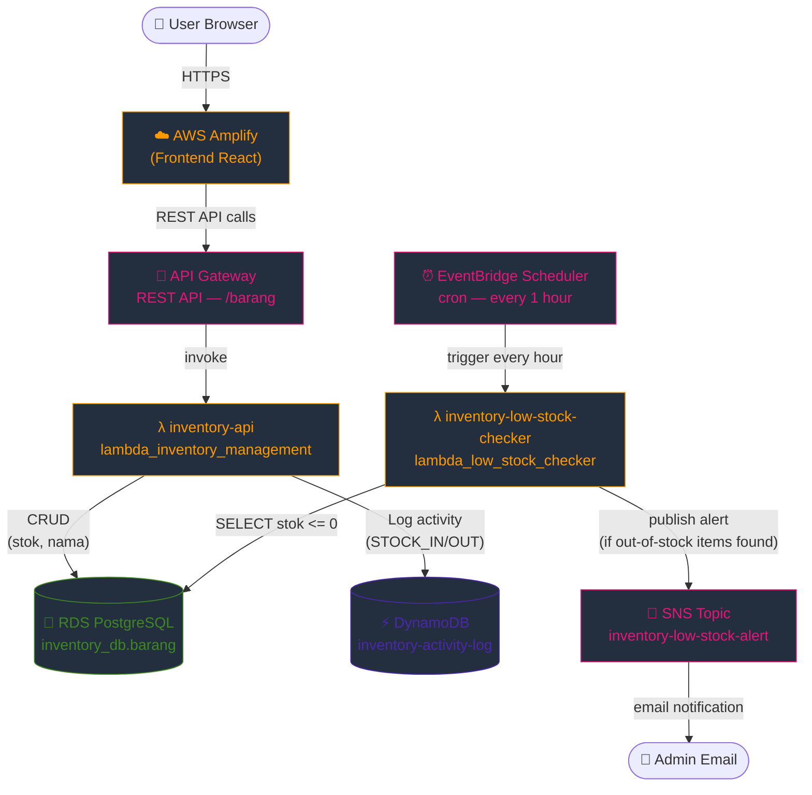

# 📦 Smart Inventory — AWS Deployment Guide

A serverless inventory system: **Amplify → API Gateway → Lambda → RDS PostgreSQL + DynamoDB**, with out-of-stock SNS alerts via **EventBridge Scheduler**.

---

## Architecture Overview



---

## Prerequisites

- AWS Academy account
- Node.js 18+ and npm
- Git

---

## Step 0 — VPC & Networking

Create a **VPC** with the following configuration:
- **Name**: `inventory-vpc`
- **IPv4 CIDR**: `10.0.0.0/16`
- **NAT Gateway**: None
- Create **2 private subnets** in different Availability Zones:
  - `private-subnet-1`: `10.0.1.0/24`
  - `private-subnet-2`: `10.0.2.0/24`

> Lambda and RDS will be placed in the **private subnets**. Without a NAT gateway, Lambda can reach resources inside the VPC (like RDS), but **not** public internet services.

**Security Group Hardening** — create both inside `inventory-vpc`:

#### `lambda-sg` (Compute Tier)
- **Inbound Rules**: None. Apply a "Deny All" policy for ingress traffic as Lambda execution is event-triggered, not connection-triggered.
- **Outbound Rules**: Allow all IPv4 traffic to ensure the function can communicate with internal VPC resources and external APIs.

#### `rds-sg` (Data Tier)
- **Inbound Rules**: Allow traffic **ONLY** from the **lambda security group**. Connect via the **default port** mandated by the database engine.
- **Outbound Rules**: Strictly **no egress**. The database tier should be isolated from initiating any outbound requests to prevent data exfiltration.

---

## Step 1 — RDS PostgreSQL

Create an RDS instance:
- Engine: PostgreSQL version 16, Template: Free tier
- Identifier: `inventory-db`, Username: `postgres`
- **VPC**: `inventory-vpc`, Subnets: `private-subnet-1` and `private-subnet-2`
- Public access: **No**


**Connect to RDS via CloudShell:**

Use these command to create database and tables

```sql
CREATE DATABASE inventory_db;
\l
\c inventory_db

CREATE TABLE barang (
    id         SERIAL PRIMARY KEY,
    nama       VARCHAR(100) NOT NULL,
    stok       INT DEFAULT 0,
    created_at TIMESTAMP DEFAULT CURRENT_TIMESTAMP
);

\dt
\q
```

---

## Step 2 — DynamoDB

Create table `inventory-activity-log`:
- Partition key: `log_id` (String)
- Billing: On-demand

Add a **Global Secondary Index (GSI)**:
- Partition key: `barang_id` (String)
- Index name: `barang_id-index`

---

## Step 3 — SNS

Create a Standard topic `inventory-low-stock-alert`. Subscribe with **Email** protocol and confirm the subscription from your inbox. Note the **Topic ARN**.

---

## Step 4 — Lambda Layer (psycopg2)

Create lambda layer based on requirements.txt file inside backend!

Create lambda function to support python3.13 version

---

## Step 5 — Lambda Functions

### `inventory-api`

| Setting | Value |
|---------|-------|
| Runtime | Python 3.12 |
| Execution role | `LabRole` |
| Handler | `lambda_inventory_management.handler` |
| Timeout | 30 seconds |
| Layer | `psycopg2-layer` |
| VPC | `inventory-vpc` |
| Subnets | `private-subnet-1`, `private-subnet-2` |
| Security group | `lambda-sg` |

Upload `lambda_inventory_management.py` as a zip. Environment variables:

| Key | Value |
|-----|-------|
| `DATABASE_HOST` | RDS endpoint |
| `DATABASE_NAME` | `inventory_db` |
| `DATABASE_USER` | `postgres` |
| `DATABASE_PASS` | RDS password |
| `DYNAMO_TABLE` | `inventory-activity-log` |

### `inventory-low-stock-checker`

| Setting | Value |
|---------|-------|
| Runtime | Python 3.12 |
| Execution role | `LabRole` |
| Handler | `lambda_low_stock_checker.handler` |
| Timeout | 30 seconds |
| Layer | `psycopg2-layer` |
| VPC | `inventory-vpc` |
| Subnets | `private-subnet-1`, `private-subnet-2` |
| Security group | `lambda-sg` |

Upload `lambda_low_stock_checker.py` as a zip. Environment variables:

| Key | Value |
|-----|-------|
| `DATABASE_HOST` | RDS endpoint |
| `DATABASE_NAME` | `inventory_db` |
| `DATABASE_USER` | `postgres` |
| `DATABASE_PASS` | RDS password |
| `SNS_TOPIC_ARN` | SNS Topic ARN |

---

## Step 6 — EventBridge Schedule

Create schedule `inventory-hourly-check`:
- Pattern: `cron(0 * * * ? *)`
- Target: `inventory-low-stock-checker` Lambda

---

## Step 7 — API Gateway

Create REST API `inventory-api` (Regional). Create the following methods, all pointing to the `inventory-api` Lambda:

| Method | Resource |
|--------|----------|
| GET | `/barang` |
| POST | `/barang` |
| PUT | `/barang/{id}` |
| DELETE | `/barang/{id}` |
| GET | `/barang/{id}/history` |

Enable CORS on all resources. Deploy to stage `prod`. Copy the **Invoke URL**.

---

## Step 8 — Frontend Environment Variable

**Local:**
```bash
cd frontend
cp .env.example .env
# Set REACT_APP_API_URL=<Invoke URL>/barang
```

**Production (Amplify):** Add `REACT_APP_API_URL` in Amplify Console → App settings → Environment variables.

---

## Step 9 — Deploy to Amplify

Push code to GitHub and connect the repository to **AWS Amplify**.

---

## Verification

After deploying, test each feature end-to-end:
- Items load from RDS via API Gateway
- Add, update, and delete items work correctly
- Activity log shows history from DynamoDB
- Items with `stok = 0` display a red **Habis** badge
- Manually invoke `inventory-low-stock-checker` and verify SNS email is received

Check **CloudWatch Logs** for each Lambda to debug errors.

---